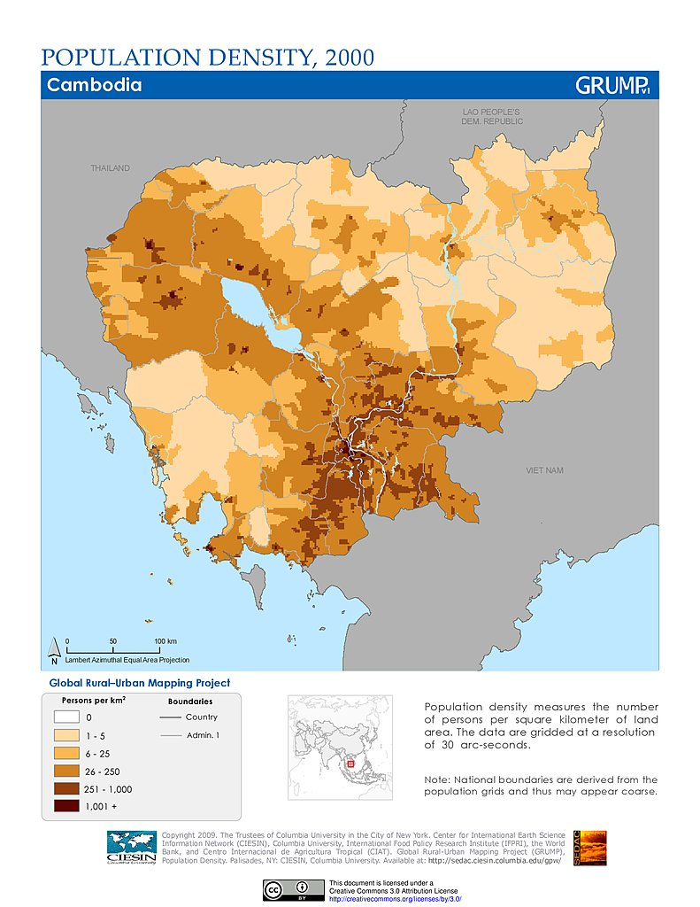

# Assignment 3: Investigate a methodology

## Geospatial Data Methods for Precise Epidemiology of Vector-borne Illnesses

Jason Deng

April 19, 2020

### Introduction

Vector-borne illnesses (VBIs)  continue to disproportionately plague many lower-middle / low income countries that are still developing, often unable to combat the illnesses. In 2016, Malaria alone caused an estimated 216 million clinical episodes and 445,000 deaths[2] and slowed economic growth by up to 1.3 percent a year, while requiring an estimated 12 billion dollars per year due to direct costs. Being able to employ effective disease control and elimination is crucial to being able to develop as a nation. This is the third goal of the UN’s sustainable development goals, or to “ensure healthy lives and promote well-being for all at all ages.” Thus, it is crucial that we are able to successfully control and eliminate diseases like VBIs through precise epidemiology. However, VBIs are difficult to combat due to the inherent nature of the diseases. We need to not only be able to track hotspots and coldspots of infections, but additionally how the diseases move. This aspect of human mobility presents a distinct risk that plays a huge role in how a disease can move and infect others. Depending on the incubation time of a disease, infected asymptomatic people can be unknowingly transferring the disease through typical daily interactions. As a result, it is necessary to track the human travel aspect of disease mobility. This requires accurate models to not only be able to predict the relations of various agents, such as people, environmental factors, or occupations, but also consistently up-to-date data from which to use for predictions. 

The models I will be looking at include a gravity model with an Empirical Bayesian Estimator (EBE) to generate an adequate model for predicting risk between different variables and the implementation of call-data records into spatial epidemiology. These methods currently are not largely being deployed into VBI research in Southeast Asian countries. My central research question will reflect off this gap, which is how can gravity models with EBE and call-data records be used to track human mobility and model the spread of vector borne illnesses for spatial epidemiology? However, I will not only be looking at how gravity models and CDRs are employed in their respective regions from the studies, but also the implications on how it can be applied in Southeast Asia in terms of spatial epidemiology.

### Inquiry Type

This research question in a larger sense is explanatory as it looks to explain how vector-borne illnesses are spread in relation to human mobility in the context of spatial epidemiology with gravity models and CDRs. Being able to have precise infectious disease control requires us to “explain” how it happens at a mathematical and geospatial level, allowing for better control and elimination of VBIs. Additional questions include: What are the differences between using census data and CDR data as a means for spatial epidemiology? What factors or predictors can be used in a gravity model to accurately predict their interactions? Most importantly, how can CDRs and gravity models be used for spatial epidemiology in Southeast Asia? I plan to not only look into how CDRs and gravity models are currently being deployed in research for other countries, but also how can it be used in the SEA region where these methods are not being employed as much.

### Gravity Model with Empirical Bayesian Estimator of Risk

In the article by Barriors et al [citation needed], the team of researchers sought to use a gravity model that could adequately search for the interactions between various spatial entities and produce an estimation of disease risk. It is derived from Newton’s Law of Universal Gravitation, which describes how there exists a force that attracts any two objects. This equation, as seen below, has found a place for modeling other domains such as transportation networks, migration flows, and more. In essence, there exists a relation between two arbitrary variables so long as the correlation is assumed or implied. 

Figure 1.  Newton's law of gravitation, where mi and mj are the different masses of the two associated objects and dij is the inverse proportional to the square distance separating them. aij is the resultant force, or “relation” between the two objects. 

The vector-borne illnesses the researchers were seeking to model were nephropathia epidemica (NE) and Lyme borreliosis (LB). Both NE and LB are vector-borne diseases, and had seen an abnormal rise of cases in Belgium. The carriers of NE and LB respectively are the bank vole Myodes glareolus and the tick Ixodes ricinus. These creatures both live in the well distributed vegetated areas throughout the country, bordering many urban areas as well. Thus, the researchers sought to create a gravity model equation that could find the relation of urban areas and vegetated areas with the risk of NE and LB. The formulation of the gravity model used in their study looked like this: 

where “R” was the estimated risk index of NE and LB. The variables that the researchers chose to relate were surface covered by vegetation (V), estimation of population (P), and fraction of economic activities (F). The distance variable represents the average distance between urban areas U and surrounding vegetated areas. Vegetated areas were included in the equation because ticks carrying LB are found in a wide range of environments including mainly forested areas. The researchers noted that “economic activities” were included since foresters, hunters, farmers, etc., work in forested areas and thus carry that risk factor. Then, the equation was log-transformed into 

This f(R) provides a function for the estimation of gravity model parameters. Explained later, this equation would be used to taste various data parameters and be compared to the EBE for risk estimation. 

Additionally, the researchers also used a local Empirical Bayesian Estimator of risk proposed by Marshall [citation needed], based on Bayesian statistics. Marshall’s algorithm is as follows, directly cited: 

where  is the EBE for municipality i, θi was calculated as the ratio between the number of cases to person-years at risk (n) in municipality i.  and âi are the prior mean and variance of relative risk, respectively, calculated over municipalities adjacent to i.[marshall citation]

Using these two equations, the researchers compared the risk estimators from the EBE and the gravity model. This was partly to validate the GM’s findings, where the GM was based off variables like vegetation cover, economic activities, and population, while the EBE used epidemiological records and demographic data. The figure below illustrates this process:

Using this, the researchers found out that the Franco-Belgian border was at highest risk for NE, and LB was moreover spread throughout the country in terms of highest risk. When compared with visuals generated by a Empirical Bayesian Estimator (EBE) of risk, the gravity model and the EBE’s risk zones were shown to be within 1 standard deviation of risk values [7]. Thus, the researchers presented the “adequacy” and accuracy of the gravity model in spatial epidemiology. They were able to use the equation to relate the “attraction” or relation between vegetation systems and various human factors, and generated a functional risk index. 

Figure 2. Estimation of disease risk for NE and LB according to Marshall’s local estimator (EBE).

Figure 3. Final GM equations as well as map representations of the modelled EBE values and the model residuals.

### Call Data Records

Utilizing call data records is crucial in being able to update information about human mobility. In a study done by Buckee et al. [6], the researchers sought to understand how human movement affects parasite transmission with malaria in Kenya. Each time a call is made, the call data is sent to a nearby cell tower, which stores information such as the caller ID, the receiver of the call, the date and time the call was made, the duration of the call, and what cell tower is the CDR stored at. A cell towers service area is around 1-3 kilometers in radius, which provides a good approximation of the location of the caller. The more cell towers in a vicinity, the more precise the location gets. Thus, in a densely populated urban area such as a big city, CDRs can be as precise as estimating a person’s location down to a city block. With CDRs and locations of all the cell towers throughout Kenya displayed in various data layers, Buckee et al. layered parasite rate maps on top to highlight the correlations between the two, as shown in the figure below. 

Figure 4. A) The population density of Kenya. B) Human settlements in Kenya C) The parasite rate in Kenya D) The location of mobile phone tower in Kenya overlaid on a settlement and parasite rate maps

### Analysis

So how can all this be used in Southeast Asia? For call data records, Buckee et al. showed that not only can CDRs be used as an accurate measure of human mobility and population mapping due to the correlation of population settlements versus mobile cell towers, but can be used to accurately track parasite mobility due to its overlay with hotspots. I’ve included the following visuals below, in order respectively,

Figure 5. Location of 4G cell towers from the carrier company "Smart" in Cambodia.  

Figure 6. Population density in Cambodia

Figure 7. Predicted S. stercoralis parasite prevalence based on survey data in Cambodia, taken from [citation]

These three visuals follow closely to what Buckee et al. were looking at in their research. Evidently, because there is a strong correlation between disease hotspots and population densities, cell towers become incredibly crucial in mapping such correlations between the two and in tracking human mobility. This is so important because there already exists the research done in order to apply the research done by Buckee et al. in Cambodia, and possibly many other SEA countries. The possibility of using mass amounts of “big data” to better understand the impact of human mobility on the spread of disease is right in front of us, waiting to be explored into as we head into a new paradigm of scientific exploration. 

Along with this, the gravity model and EBE can be utilized for better mathematical predictions of disease risk. The gravity model can be used with any variables, so long as the correlation exists. For example, we can build off from the research done by Grietans et al, where they characterized types of human mobility in its relation to malaria elimination. They looked at forest activities, wet rice field movements, rural-to-rural migration, and many other types of mobility. Similar to how Barrios et al. used forest activities as a variable, many aspects of human mobility and activity can be modeled with the gravity model. This is then supplemented by the EBE, which provides an estimator that is more based on epidemiological information. So long as the gravity model and the EBE’s risk zones are within 1 standard deviation of another, the “adequacy” of each model is met. 

Whereas current methods of approaching VBD epidemiology uses census/survey data with GIS modelling technologies, which may be outdated in many cases of low-income SEA countries, the GM and EBE provide a better means of estimating and modelling human mobility while allowing the usage of a smaller, more precise sample size. Additionally, CDRs will help researchers depend less on census data and be able to better track human mobility. It is already being done in several countries in Africa, i.e Barrios et al. The gap that exists are the methods I’ve talked about not being utilized enough in SEA. There exists more updated/contemporary methods for better predictions and models of precise spatial epidemiology that can be used in the SEA region. 

